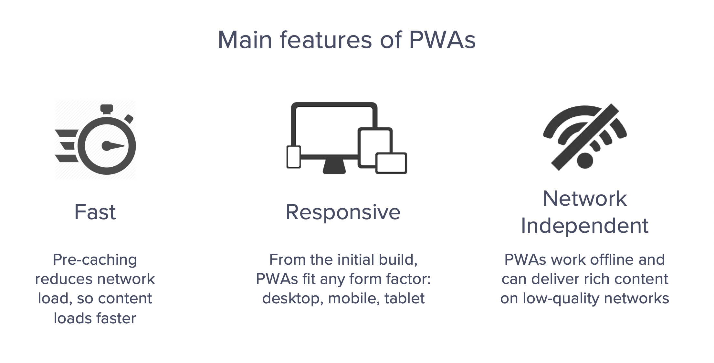
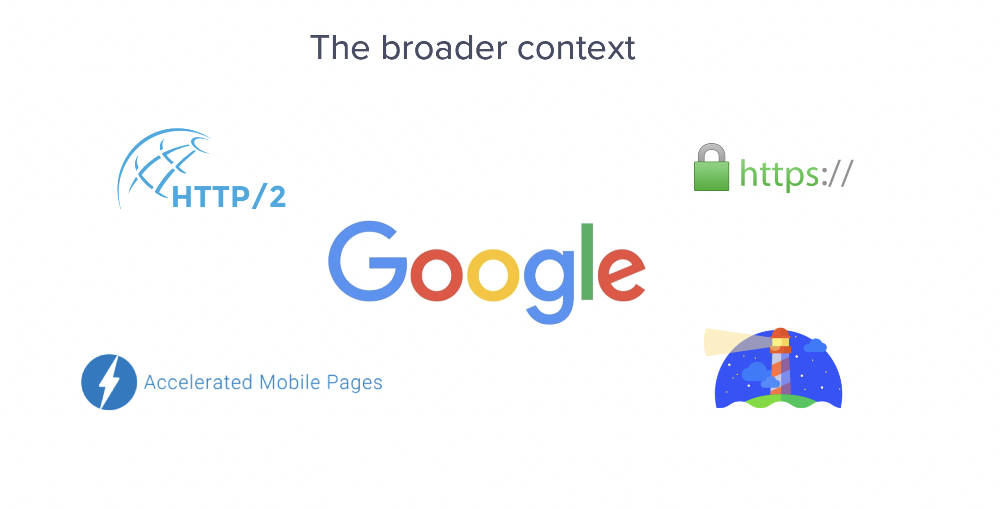
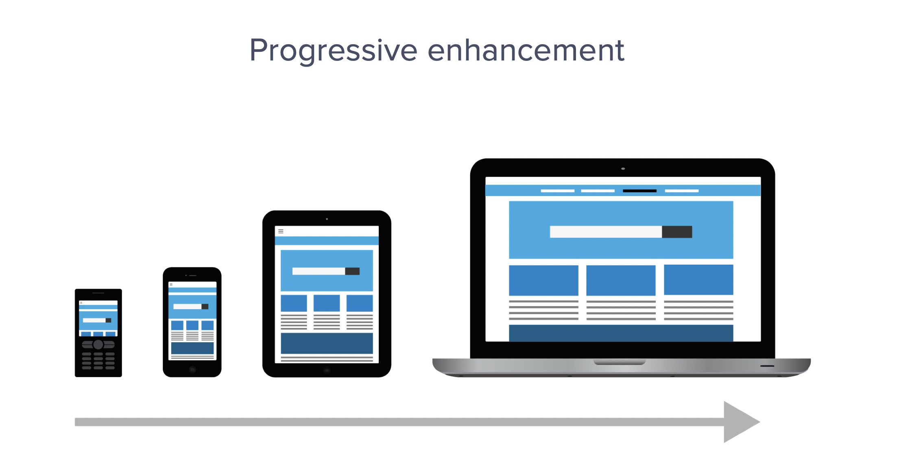
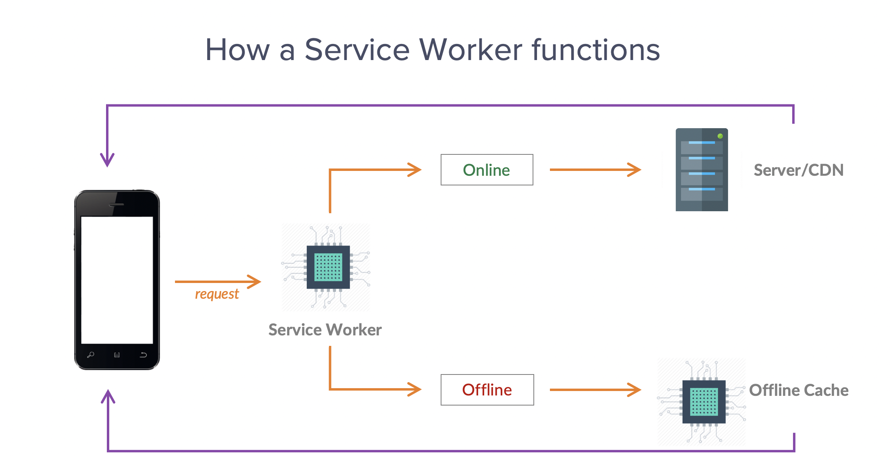

## Introduction

Towards the end of last year, I spent two days at Google's London HQ learning how build progressive web apps, and today I’m going to tell you how you can use this technology to build fast, reliable and immersive mobile experiences.

> This is a transcript of a talk I gave at a former employer, hence it is more of a top-level overview than a detailed tutorial.

## What is a progressive web app?

So, what is a progressive web app? Progressive web apps are traditional web applications enhanced with modern technologies. When they’re enhanced in this way, they’re able to provide an app-like experience within mobile browsers

### What are the main features?

Well, the first thing to note is that they’re **fast**. When you build a progressive web app the first requirement is that you pre-cache all of your site’s largest static resources. By doing so, you reduce the overall network load, which allows content to load faster.

They’re also **responsive**, because, again, from the initial build it has to be the case that PWAs are capable of fitting any form factor – be it desktop, mobile, tablet or future devices.

Finally they’re **network independent**. PWA’s work offline, and because of this they can deliver rich content on low-quality networks.

## Who is using progressive web apps?

One of the biggest organisations to invest in the technology is the _Washington Post_. The _Washington Post_ was an early adoptor, launching its PWA in 2016. Whether you access the newspaper on desktop, on phone, or on tablet, you’ll be making use of PWA technology. In addition to this, it’s also built using AMP HTML – accelerated mobile pages – which again promotes faster content loading.

One of our clients, the _Financial Times_ (another large-scale media enterprise) also runs a PWA version of their site alongside a traditional website, accessible at [https://app.ft.com/](https://app.ft.com/).

### How the _Washington Post_ has benefited

So, what are the benefits? How was the _Washington Post_ able to turn PWA technology to their advantage? Well, they’re capable of publishing over 1000 articles a day, which goes to prove how robust the PWA framework is. As well as this, they record an 88% reduction in load time compared with the traditional mobile version of their site. And, finally they record a 27% increase in organic users who return within seven days, proving that when within a PWA environment companies are able the boost their customer retention.

## Why is Google investing in PWAs?

But why are Google invested in PWA technology? To understand this we need to look at the broader context. Progressive web apps are part of a broader initiative on Google’s part, to make the 21st century web fit for purpose. The way we use the internet today, and crucially our expectations about how the internet should work, do not fit with its original cryptographically insecure,desktop based, English language, 1990s version of the internet.

So, Google has introduced several initiatives which go some way to remedying that. We have [HTTP/2](https://developers.google.com/web/fundamentals/performance/http2/) for faster data packet transfer. We have [HTTPS](https://en.wikipedia.org/wiki/HTTPS), to make basic and fast encryption mandatory, not an optional extra. And we have [accelerated mobile pages](https://amp.devAMP) (AMP), for richer and speedier mobile browsing experiences. Finally, there’s [Google Lighthouse](https://developers.google.com/web/tools/lighthouse/), a diagnostic tool which developers can use to check the speed and integrity and overall security of the sites they manage.

## How do progressive web apps work?

How do progressive web apps work? We’re going to drill down a little bit now and look at some of the core technologies which are behind it. We’re going to start with this concept of progressive enhancement.

### 'Progressive enhancement'

Progressive enhancement is the core tenet guiding the engineering of PWAs. It contrasts with the notion of graceful degradation, whereby as time goes on, older devices becomes less and less capable of supporting the latest features, requiring an upgrade. The idea behind Progressive Web Apps is that where there are web users on poor connections, limited hardware, or in countries where there is an undeveloped cellular network, these sorts of people should not be penalised or prevented from accessing fast and rich content. In fact, these are the very sorts of people that PWAs are designed to serve.

But, progressive enhancement also has another element to it, and this comes down to how you actually build the app, from the developer’s point of view. So PWAs are progressive, in terms of their technical implementation, and the key point here is that there is more than one way to implement a progressive web app. It’s not one size fits all, instead it’s highly modular and can be adapted to the needs, the specific needs of your business or market.

For instance, it’s possible to build a progressive web app just using HTML, or HTML and CSS. However, once you introduce JavaScript the capabilities increase by many factors because it’s JavaScript that enables the service worker, which is the technology which is responsible for the pre-caching I spoke about at the beginning. But the service worker doesn’t have to apply to the whole site, you can restrict it to a sub-domain or a sub folder to test the benefits of PWA, and if it meets your needs and it’s working you can extend its scope. You can also introduce further API’s, save to home screen functionality and also push notifications. So, we see how the progressive web app technology scales up.

### PWAs are inherently responsive

Another concept that’s at the core of progressive web apps is that they are inherently responsive. What does this mean? Well when you build a Progressive Web App you start with the application shell, this is basically an empty template or boilerplate that contains the app’s most basic graphic assets. These are the very things that are pre-cached in that initialisation process. During the pre-caching process, however, you must optimise your assets for responsiveness and speed, and one of the ways that you do that is by using these technologies along the bottom of the screen here, which I’m sure are familiar to our people in the Creative Department.

So, these are developments in HTML and CSS, which enable you to ensure that your content scales up to different devices, it’s not all being handled solely by media queries. Once that’s in place, the same app can function across devices.

### The service worker

The last technical aspect we’re going to look at is the service worker, and we’re going to look at how it functions. So, we’ve cached our resources, now let’s look at how it works in practise. So we have a user on a PWA, and they click a link. Now, normally this would send a request to the server using the usual client server internet architecture. But what happens with a PWA is that the service worker intercepts the request and it checks the request against its internal cache, which is, of course, offline. If it finds the content in that cache it will return it straight to the user, without troubling the server at all.

If, however it comes up empty and the resource is not contained in its cache, it goes through the normal process of going to the server, and then it would return the content. This is an idealisation, in reality it’s unlikely that one whole resource would be served from the offline cache, it’s much more likely that the static resources, the fonts, the CSS files, etc., would be stored in the cache, and then the raw textual content would come from the server. But still, with that in place, it still means that there are reduced network requests, which makes it load faster. So, there’s a, as I say, a simplified and idealised version of the process.

## Who else is using PWAs?

I’d like to return to that question that I asked earlier though, and ask who else is using progressive web apps? You might remember that I talked about the initial internet being English language based and very centred on America and an American architecture. This is an example of another type of company that has used a PWA, and it’s called [Konga](https://www.konga.com).

Konga are like the equivalent of Amazon or eBay in Nigeria. And the interesting thing about Nigeria is that in addition to being economically poor it’s also informationally poor. So, the majority of people in Nigeria access internet via phones, but on 2G networks. Given the scarcity of the network infrastructure it’s very expensive to access the 2G network. So, Nigerians are very loathed to actually use their phones for extended browsing.

This is another ample opportunity where PWA technology can be used, because it’s reducing the network load, as I’ve said, so it’s going to be less expensive for Nigerians to access content at this site. And again, we see that the effects have been very positive.

So, there’s been a 92% reduction in the amount of data required for the initial load, compared with when they previously just had a bog-standard, normal phone app. And, as well as this, there’s 82% less data required in order to complete the first transaction, be that a goal or a conversion. So, I just wanted to give you another window on how this technology is really revolutionising mobile browsing across the world.

## Summary

To recap, the main features of progressive web apps:

- They’re fast, because they implement JavaScript service workers, which can pre-cache resources so that they’re accessible offline, reducing the number of requests to the server.
- They’re responsive, because at the very outset it’s necessary that they meet the latest standards in responsive design.
- And they’re network independent, they can work offline and deliver rich content on low quality networks.

## Technical resources and further examples

- The full Google documentation for PWAs is available [here](https://developers.google.com/web/progressive-web-apps/).
- There are some great examples of live progressive web apps at [PWA Rocks](https://pwa.rocks/). As a Pokémon fan and space nerd, my particular favourites are the [Pokédex](https://pokedex.org/) and the [NASA Code Library](https://code.nasa.gov/).
